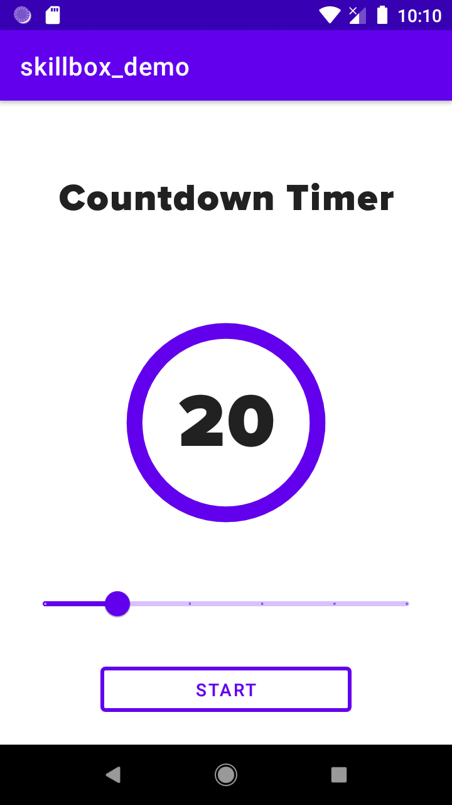

## Урок 10. Жизненный цикл приложения

---
## Цель практической работы:
Применить знания по жизненному циклу приложения и сохранению состояния при смене конфигурации.
## Что входит в работу
- Разработать приложение «Таймер обратного отсчёта».
- Доработать приложение «Таймер обратного отсчёта».

## Задание 1. Разработка приложения «Таймер обратного отсчёта»
Что нужно сделать

Разработайте приложение «Таймер обратного отсчёта» с использованием TextView, ProgressBar, Button, SeekBar/Slider.
1. Создайте пустой Android-проект.
2. Подготовьте стили и темы, необходимые для проекта, добавьте ресурсы; создайте drawable, который будет использоваться для отображения прогресса в компоненте ProgressBar.
3. Сверстайте layout. Сверху — текст, по центру — ProgressBar, внутри него — TextView для отображения прогресса. Ниже — SeekBar/Slider для установки времени. В самом низу — outlined Button для старта и остановки таймера. 

Пример экрана приложения:

4. Опишите логику программы в главном Activity.

## Рекомендации
- Следуйте плану. Начать лучше с ресурсов проекта и вёрстки.
- Для реализации таймера понадобится цикл, в котором нужно каждую секунду перерисовывать UI. Не забудьте, что главный поток в Android нельзя блокировать, но в то же время нельзя менять UI из других потоков. Самым простым способом будет использование корутин с Main диспетчером и метода delay, который не блокирует поток.
- После старта таймера некоторые компоненты лучше деактивировать, чтобы пользователь не мог нарушить работу программы.

## Задание 2. Доработка приложения «Таймер обратного отсчёта»
Что нужно сделать

Доработайте приложение «Таймер обратного отсчёта», применив знания по теме «Жизненный цикл приложения».
1. После запуска отсчёта времени и поворота экрана счётчик должен продолжать отсчёт.
2. После того как отсчёт завершился, при повороте экрана он не должен запуститься вновь.
3. Все view должны остаться в том состоянии, в котором они были до поворота экрана (SeekBar/Slider заблокирован/разблокирован и его положение не изменилось, кнопка отображает правильное действие).

## Рекомендации
- Используйте константы для ключей в savedInstanceState.
- Проверьте, что нет утечек при запуске таймера, то есть после запуска и поворота экрана работает один только счётчик.
- Если приложение не запускается или не отображается нужное состояние, постарайтесь внимательно проанализировать информацию об ошибке и добавить нужное исправление.

## Что оценивается
- UI содержит все необходимые компоненты.
- Логика программы не нарушена. Можно установить время, запустить таймер и дождаться его окончания. После окончания можно заново запустить таймер. Есть возможность остановить таймер.
- Логика программы не нарушается после поворота. Можно установить время и запустить таймер в одном положении, дождаться завершения и остановить — в другом.
- Нет критичных багов и вылетов.
- Код чистый, у переменных и компонентов понятные названия, соблюдаются принципы ООП.

## Как отправить работу на проверку
1. Используйте репозиторий android_dev_1_2022.
2. Скачайте изменения в репозитории на свой компьютер.
3. Выполните практическую работу в папке m10_timer_life_cycle. Отправьте коммиты в удалённый репозиторий.

## Решение: m10_timer_life_cycle