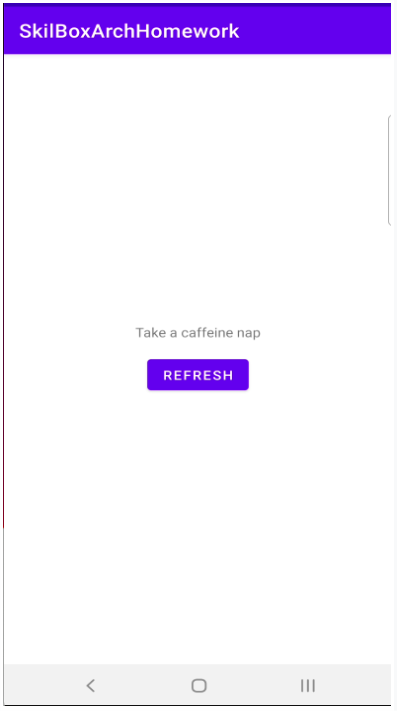

## Урок 16. Архитектура проекта

---
## Цель практической работы:
- Применить принципы чистой архитектуры при разработке реального Android-приложения.

## Что нужно сделать
Разработайте приложение, которое при нажатии кнопки будет предлагать пользователю, чем он может заняться.
*  Занятия возьмите из [www.boredapi.com](https://www.boredapi.com/).
* Приложение должно быть разделено на слои.
* Для связывания компонентов приложения между собой используйте Dagger или Hilt.

1. Сверстайте экран, аналогичный тому, который показан на скриншоте.
2. Создайте интерфейс UsefulActivity в пакете entity с полями, соответствующими [json из ответа API](https://www.boredapi.com/).
3. Создайте UsefulActivityDto в пакете data, который реализует интерфейс UsefulActivity.
4. Создайте класс UsefulActivitiesRepository в пакете data с методом getUsefulActivity, который возвращает UsefulActivity.
5. Реализуйте в UsefulActivityRepository получение данных из [API](https://www.boredapi.com/), как вы это делали в модуле по работе с сетью. Для десериализации данных используется UsefulActivityDto.
6. Создайте GetUsefulActivityUseCase в пакете domain с методом execute, возвращающим UsefulActivity.
7. В юзкейсе в конструкторе прокиньте UsefulActivitiesRepository и получите из него данные в методе execute.
8. В пакете presentation создайте MainViewModel, прокиньте в его конструктор GetUsefulActivityUseCase, добавьте в View-модель
StateFlow для подписки на них в Fragment/Activity, а также метод reloadUsefulActivity, который должен получать UsefulActivity из юзкейса и прокидывать его в StateFlow.
9. Добавьте View-модель в Fragment/Activity (стандартно через by viewModels, если был выбран Hilt, либо заинжектьте его, как было показано в этом модуле, если был выбран Dagger), подпишитесь на её изменения, чтобы показывать в UI текст из поля activity из UsefulActivity.
10. Добавьте вызов метода View-модели reloadUsefulActivity по нажатии на кнопку.
11. Добавьте поддержку DI: пометьте нужные классы аннотацией @Inject, затем, если был выбран Dagger, опишите компонент в пакете di, как это было показано в этом модуле. Если был выбран Hilt, пометьте все Fragment/Activity аннотацией @AndroidEntryPoint, View-модель — аннотацией @HiltViewModel, а также создайте Application-класс, пометьте его аннотацией @HiltAndroidApp и добавьте его в манифест.

## Советы и рекомендации
* Чтобы получить предложения для занятий, надо использовать запрос GET: https://www.boredapi.com/api/activity.
* Для запросов не обязательно писать отдельный DataSource, как было показано в примере в этом модуле. Разрешается описать логику запроса сразу в репозитории. Если есть желание, DataSource тоже можно написать.
* Для работы с DI можно использовать Dagger 2 или Hilt (по желанию).
* Конструкторы репозитория, юзкейса, View-модели и так далее нужно пометить аннотацией @Inject, чтобы не писать модули для их создания. Конструкторы основных Android-классов: Activity, Fragment, Application — аннотациями помечать не надо!
* Если был выбран Dagger, компонент и модули (если потребовалось их создать) необходимо создавать в пакете di.
* Если был выбран Hilt, View-модель можно пометить аннотацией @HiltViewModel. Тогда не надо будет явно инжектить View-модель в Fragment/Activity, достаточно будет, как обычно, применить by
viewModels() при инициализации View-модели.
* Не забудьте проставить аннотации @HiltAndroidApp, @AndroidEntryPoint и @HiltViewModel, если используете Hilt.

## Что оценивается
* Приложение работает стабильно, не крашится.
* При нажатии на кнопку занятие обновляется.
* В коде приложения есть сущность, которая представляет данные предлагаемого занятия.
* В коде приложения есть репозиторий для работы с API boredapi.com.
* В коде приложения есть юзкейс, который получает сущность занятия через репозиторий.
* В коде приложения есть View-модель, которая получает данные о занятии из юзкейса в виде сущности.
* В приложении реализован подход MVVM.
* Все компоненты связываются с собой посредством Dagger или Hilt, ручного DI быть не должно.
* Код чистый, у переменных и компонентов понятные названия, соблюдаются принципы ООП.

## Как отправить работу на проверку
1. Используйте репозиторий android_dev_1_2022.
2. Скачайте изменения в репозитории на ваш компьютер.
3. Выполните практическую работу в папке m16_architecture. Отправьте коммиты в удалённый репозиторий.

## Решение: m16_architecture