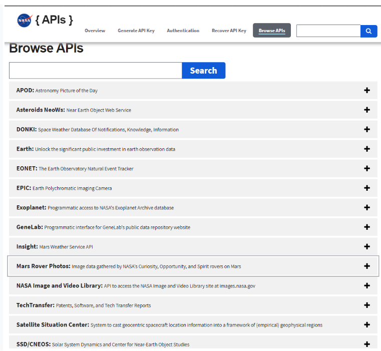
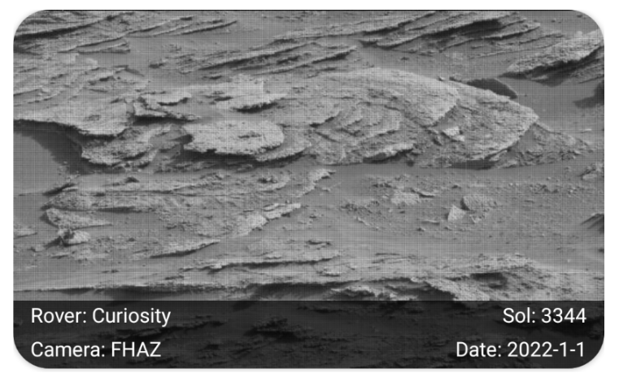

## Урок 17. Работа с массивами данных

---
## Цель практической работы:
* Потренироваться работать со списками.

## Что нужно сделать
Разработайте небольшое приложение для отображения списка фотографий с Марса. Для этого воспользуйтесь открытым Nasa API.
## Подготовка к работе
Nasa API находится по адресу https://api.nasa.gov и имеет несколько эндпоинтов для загрузки различной информации:
* об астероидах;
* о погоде на Марсе;
* фотографии Земли в космосе и со спутника;
* фотографии, сделанные марсоходами на Марсе;
* и многое другое.

Мы будем использовать API для загрузки фотографий, сделанных марсоходами.
Чтобы воспользоваться Nasa API, нужно зарегистрироваться и получить персональный API-KEY, который в дальнейшем используем для совершения запросов. В документации к API сказано, что можно использовать специальный API-KEY — «DEMO_KEY», однако у этого ключа есть ограничения на 30
запросов в час и 50 запросов в сутки с одного ip-адреса.

Для регистрации заполните форму по адресу https://api.nasa.gov/#signUp, указав имя, фамилию и адрес почты (данные могут быть анонимными). В результате откроется страница с указанным персональным ключом, который нужно будет использовать в качестве query-параметра для запроса, и
примером использования этого ключа в запросе. Для практической работы будем использовать Mars Rover Photos API. Его описание можно найти на сайте https://api.nasa.gov/ (необходимо выбрать его
из списка). 

С помощью этого API можно загрузить фотографии, сделанные различными марсоходами. API находится по адресу https://api.nasa.gov/mars-photos/api/v1/rovers/curiosity/photos и принимает различные query-параметры. Подробное описание в документации к API на сайте.
Примеры запросов:
* https://api.nasa.gov/mars-photos/api/v1/rovers/curiosity/photos?sol=1000&api_key=YOUR_API_KEY — загрузка всех фотографий, сделанных ровером Curiosity за 1000 сол.
* https://api.nasa.gov/mars-photos/api/v1/rovers/curiosity/photos?earth_date=2022-1-1&api_key=YOUR_API_KEY — загрузка фотографий, сделанных ровером Curiosity 1 января 2022 года.

## Этапы работы
1. Создайте новый проект и [подключите к нему RecyclerView](https://developer.android.com/jetpack/androidx/releases/recyclerview).
2. Для загрузки информации используйте [Mars Rover Photos API](https://api.nasa.gov/).
3. Подключите необходимые библиотеки для загрузки данных из сети и навигации (если это необходимо)
4. Реализуйте загрузку данных из Nasa API с помощью библиотеки для загрузки данных, создайте необходимые классы и опишите модель данных в соответствии с документацией API. Вы можете открыть любой из запросов в браузере. Результатом будет json-строка, которая содержит загруженные данные. Для лучшей визуализации скопируйте полученный json в какой-нибудь json-парсер
(например, http://json.parser.online.fr) и создайте класс, который будет описывать полученные данные. Для загрузки и отображения данных используйте шаблон MVVM.
5. Проанализируйте полученный класс и создайте разметку для элемента списка. Например, такую:

6. Создайте активити или фрагмент для отображения списка. Добавьте в разметку RecyclerView и установите необходимый LayoutManager.
7. Создайте Adapter и ViewHolder для отображения загруженных данных на UI. Реализуйте необходимые функции у адаптера и установите адаптер в RecyclerView. Для асинхронной загрузки изображений используйте библиотеку [Glide](https://github.com/bumptech/glide#how-do-i-use-glide).
8. В результате у вас должен получиться прокручивающийся список, который отображает фотографии и информацию о них. Поэкспериментируйте с разными LayoutManagers.
9. Сделайте так, чтобы можно было открыть фотографию на весь экран.
Для этого:
    * установите clickListener для элемента списка,
    * создайте отдельный экран для просмотра изображения,
    * передайте URL фотографии в этот экран,
    * вновь отобразите фотографию с помощью Glide (Glide кеширует изображения, поэтому повторной загрузки изображения не будет).
10. Выполните по желанию
Nasa API поддерживает пагинацию. Для этого необходимо добавить в запрос query-параметр page. Подключите библиотеку [Paging 3](https://developer.android.com/topic/libraries/architecture/paging/v3-overview#setup) к проекту.
11. Выполните по желанию
Добейтесь постраничной загрузки изображений. Для этого реализуйте и подключите необходимые компоненты библиотеки Paging 3 к
RecyclerView:
    * PagingDataSource,
    * PagedAdapter,
    * Pager и Flow<PagingData<YOUR_CLASS>>.

Помните, по умолчанию Paging Library загружает три страницы для плавности прокрутки. Для индикации того, что загрузка идёт постранично, можно использовать функцию delay(2000) в репозитории.

## Рекомендации по выполнению
* [Public NASA Api](https://api.nasa.gov/)
* [LayoutManager ы](https://developer.android.com/guide/topics/ui/layout/recyclerview#plan-your-layout)
* [Создание адаптера](https://developer.android.com/guide/topics/ui/layout/recyclerview#implement-adapter)
* [DiffUtil](https://developer.android.com/reference/androidx/recyclerview/widget/DiffUtil)
* [Paging 3 library](https://developer.android.com/topic/libraries/architecture/paging/v3-overview),[создание PagingSource](https://developer.android.com/topic/libraries/architecture/paging/v3-paged-data#pagingsource), [создание PagingAdapter](https://developer.android.com/topic/libraries/architecture/paging/v3-paged-data#recyclerview-adapter)
* [Библиотека для загрузки изображений Glide](https://github.com/bumptech/glide#download)

Если с какими-то заданиями возникнут проблемы, попросите помощи у куратора.

## Что оценивается
* Выполнены все обязательные пункты задания, в работе использованы RecyclerView и PagedLibrary.
* Приложение работает корректно, не крашится и не завершается с
ошибкой.
* В приложении реализован подход MVVM.
* Все переходы в приложении отрабатывают корректно.
* Код чистый, у переменных и компонентов понятные названия, соблюдаются принципы ООП.

## Как отправить работу на проверку
1. Используйте репозиторий android_dev_1_2022.
2. Скачайте изменения в репозитории на ваш компьютер.
3. Выполните практическую работу в папке m17_recyclerview. Отправьте коммиты в удалённый репозиторий.

## Решение: m17_recyclerview