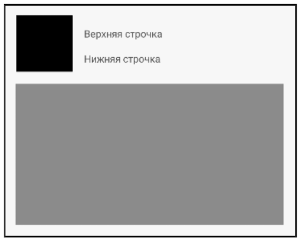

## Урок 2. Вёрстка экранов

---
## Цель практической работы:
Цель практической работы.

## Что нужно сделать:
Создайте CustomView по примерному шаблону какого-либо поста в соцсети (смотрите картинку), используя знания о ViewGroup.



Вёрстка должна быть с отступами (все отступы в макете 16dp).
CustomView должен встраиваться в main_activity.xml и отображаться при запуске приложения.
Тексты внутри виджетов «Верхняя строчка» и «Нижняя строчка» должны настраиваться из кода MainActivity. Например: из кода MainActivity настройте CustomView так, чтобы отобразилось «верхняя строчка, настроенная из кода», «нижняя строчка, настроенная из кода».

## Советы и рекомендации:

• Чёрный квадрат можно сделать при помощи FrameLayout c таким бэкграундом:
```
android:background="@android:color/black"
```

• Серый квадрат тоже сделайте с помощью FrameLayout background = @android:color/darker_gray
```
android:background="@android:color/darker_gray
```

• Убедитесь, что верхняя и нижняя строчка не переносятся на новую строку, когда в них подставляется длинный текст. Например, попробуйте подставить
```
android:text="@tools:sample/lorem/random"
```
• Чтобы текст не переносился, используйте атрибуты
```
android:lines="1"
android:ellipsize="end"
```

Попробуйте поменять значение атрибута ellipsize при длинном тексте, например на middle, и посмотрите, что произойдет со значением текстового поля.


### Решение: m2_layout