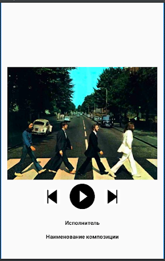

## Урок 3. ConstraintLayout

---
## Цель практической работы:
Применить знания по верстке с помощью ConstraintLayout для создания типового макета мобильного приложения.

## Что нужно сделать:
Создайте экран по такому макету, используя только ConstraintLayout в качестве единственной ViewGroup.

## Требования:
* Все отступы, кроме отступа кнопки от картинки, равны 16 dp.
* Кнопка Play имеет размеры 80х80.
*  Кнопки «Перемотка назад» и «Перемотка вперёд» имеют размеры 40х40 dp и выровнены по центру относительно кнопки Play.
* Обложка альбома выровнена по центру экрана как по горизонтали, так и по вертикали.
* TextView «Исполнитель» и «Наименование композиции» выровнены по горизонтали относительно экрана.

## Советы и рекомендации:

Попробуйте менять масштаб экрана и размер картинки, убедитесь, что вёрстка выглядит корректно при изменениях.

## Что оценивается:
* Вёрстка похожа на макет.
* Единственный используемый ViewGroup — СonstraintLayout.
* ImageView «Обложка альбома» выровнена по центру экрана.
* Кнопки «Перемотка назад» и «Перемотка вперёд» центрированы по вертикали относительно кнопки Play.
* Текстовые поля выровнены по центру экрана по горизонтальной оси.
* При изменении размеров картинки по высоте элементы так же пропорционально смещаются за ней.
* Нет критичных багов и вылетовт.
* Код чистый, у переменных и компонентов понятные названия, соблюдаются принципы ООП.

### Решение: m3_constraint