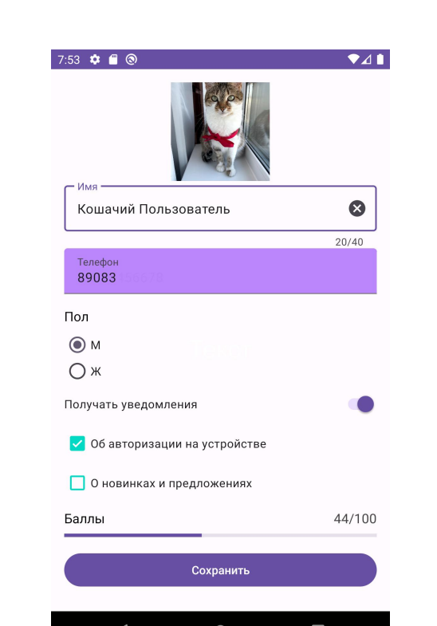
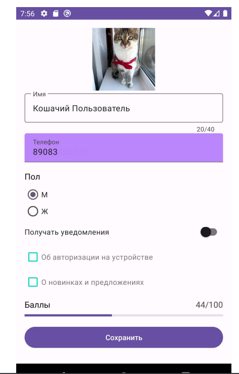
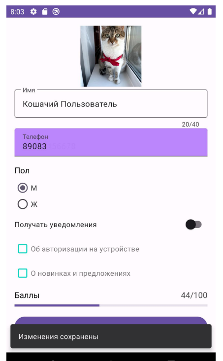
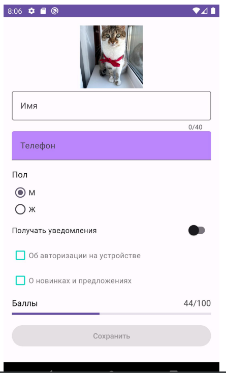

## Урок 4. Основные компоненты пользовательского интерфейса

---
## Цель практической работы:
* Научиться применять базовые компоненты пользовательского
интерфейса.
* Создать экран профиля пользователя, используя такие компоненты, какTextView, ImageView, TextInputLayout/TextInputEditText, RadioButton/RadioGroup, MaterialCheckBox, SwitchMaterial, LinearProgressLayout, Button, Snackbar, Toast.

## Что нужно сделать:
Создайте экран профиля пользователя, к элементам которого примененыстили и который имеет следующий вид:



## Требования:
### Экран состоит из следующих компонентов:
1. Фото пользователя. Квадратное изображение размером 120 ×120dp. Добавьте подходящее изображение. Для оптимального отображениякартинки попробуйте воспользоваться разными scale type.
2. Имя. Поле для ввода текста. Текстовая клавиатура, ограничениенаввод— не более 40 символов. Доступна опция удаления текста. 
3. Телефон. Поле для ввода текста. Тип ввода —номер телефона. Применён стиль FilledBox, цвет фона — фиолетовый (#BB86FC). 
4. Заголовок «Пол». Стиль: размер текста — 16 sp, цвет текста —чёрный(#000000). 
5. RadioGroup с заголовком для выбора пола. 
6. Switch для включения/отключения уведомлений. 
7. Два checkbox для выбора уведомлений, которые пользователь хочетполучать. Стиль: цвет — бирюзовый (#03DAC5). 
8. Заголовок «Баллы». Стиль: размер текста —16 sp, цвет текста—чёрный (#000000). 
9. Линейный прогресс отображает количество баллов пользователяот0до100. 
10. Текстовая информация о количестве баллов. Стиль: размер текста—16 sp, цвет текста — серый (#444444). 
11. Кнопка сохранения.
### Требования к стилям
* Стили текстов применяются через textAppearance. 
* Похожие стили наследуются друг от друга (заголовки и количествобаллов). 
* Стили checkbox применяются в теме (атрибут в теме checkboxStyle—поаналогии с materialButtonStyle из видео, базовый стиль —для CheckboxWidget.Material3.CompoundButton.CheckBox).
### Настройки темы
Используя свои цвета, переопределите атрибуты темы colorPrimary, colorSecondary и другие. Изучите, каким образом будет меняться внешнийвидэлементов, к которым вы не применяли собственные стили. 
#### Логика работы Switch — переключателя уведомлений
Если Switch выключен, список получаемых уведомлений блокируется. Иначепользователь может выбирать из множественного списка.


### Логика работы линейного прогресса
Установите значение прогресса и текстового поля, описывающее прогрессслучайным образом с помощью
```
Random.nextInt(101)
```
который вернёт число от 0 до 100 включительно. 
### Логика работы кнопки «Сохранить»
Кнопка активна, если выполняются все следующие условия:
1. значение в поле «Имя» введено корректно, то есть поле не пустоеиколичество символов не превышает 40;
2. значение в поле «Телефон» введено корректно, то есть поле непустое;
3. выбран пол;
4. если активен переключатель, должен быть выбран хотя быодинвидуведомлений. 

При нажатии на активную кнопку «Сохранить» показывается уведомлениеотом, что информация сохранена.



Для показа уведомления о сохранении можно использовать Snackbar илиToast. Если нарушено хотя бы одно из условий a–d, кнопка «Сохранить» неактивна.

## Советы и рекомендации:

Попробуйте менять масштаб экрана и размер картинки, убедитесь, что вёрстка выглядит корректно при изменениях.



### Порядок действий
1. Создайте пустой Android-проект. Убедитесь, что подключена библиотекаMaterial Design. 
2. Подготовьте стили и темы, необходимые для проекта, добавьтересурсы. Найдите подходящее изображение для профиля. 
3. Сверстайте layout по предложенному макету, примените все необходимые свойства для компонентов, чтобы их внешний видиповедение соответствовали заявленным требованиям. 
4. Последний шаг — это код. Опишите логику программы в главномActivity. Подпишитесь на уведомления об изменениях компонентов и на основании получаемых данных принимайте решения. 
### Советы и рекомендации
* Чётко следуйте плану. Начать лучше с ресурсов проекта и вёрстки. 
* За блокировку view отвечает свойство isEnabled. 
* Выносите значения строк, размерностей, цветов в ресурсы. 
* При проверке условий используйте логическое И (&&), когда требуетсявыполнение всех частей. A && B истинно тогда и только тогда, когдаиAи B истинны. Когда достаточно выполнения хотя бы одного из условий, используйтелогическое ИЛИ (||). A || B истинно, когда истинно только А, толькоB, и А и B. 
### Что оценивается
* UI содержит все необходимые компоненты, применены необходимыестили, тема настроена. 
* Логика программы не нарушена. 
* Нет критичных багов и вылетов. 
* Код чистый, у переменных и компонентов понятные названия, соблюдаются принципы ООП-. 
### Как отправить работу на проверку
1. Используйте репозиторий android_dev_1_2022. 
2. Скачайте изменения в репозитории на ваш компьютер. 
3. Выполните практическую работу в папке m4_components. Создайтепроект внутри папки, сделайте коммит или несколько коммитов. Отправьте коммиты в удалённый репозиторий.

### Решение: m4_components